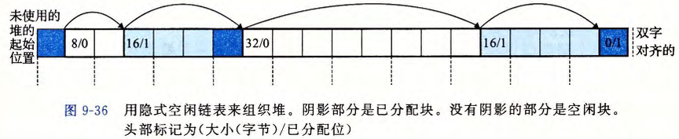

## 8. 虚拟内存

- **虚拟内存(VM)**是对主存的抽象，能为每个进程提供一个**连续**，**一致且私有**的虚拟地址空间(VAS)，并通过将**主存作为外存的缓存**，实现了内存的高效管理与访问保护；

> 本章中，我们总假设 VAS 包含 $N=2^n$ 个地址，PAS 包含$M=2^m$个地址；

### 8.0. 虚拟内存的实现与机制

- VM逻辑上就是一个大数组(大小对应VAS)，其被分割成若干个**虚拟页(VP)** ；对应的，物理内存也被分割成同样大小的**物理页(PP，也叫页帧)** ；数据**以页为基本单位**在物理内存和磁盘间传输；

  > 假设 VP 与 PP 大小为$P=2^p$字节 (通常是4KB~2MB)；

- VP有三种状态：

  - 未分配：空的逻辑页，不占用磁盘/主存空间；
  - 未缓存：已经分配，存入磁盘，但是未缓存到主存中的页；
  - 已缓存：已经分配，存入磁盘，也缓存到主存中的页；

#### 8.0.0. 页表

- 在物理内存的内核专用区域中，OS会为每个进程**单独维护一个页表**；页表实际就是一个数组，数组项称为页表项(PTE)，**每个VP都对应一个PTE**；

- PTE由两部分组成：一个有效位(Valid)和物理页号(PPN)；

  > 在实际中，PTE不仅包含有效位和PPN，还有访问权限位，脏位，使用位等，这里简化了；

  - 若有效位为1，表明对应的VP已缓存到主存中；
  - 若有效位为0：
    - 且PPN不为空，表明对应的VP已分配 (存在磁盘上)；
    - 且PPN为空，表明对应的VP未分配 (不占用任何存储空间)；

##### 页命中

- CPU生成一个VA，**内存管理单元(MMU)**根据该VA定位到对应的PTE，若此时有效位为1，表明对应的VP已缓存，MMU通过PPN和部分VA得到PA，从而到物理内存中访问到这个页；

  > 这个过程就是**地址翻译**，具体见后文

##### 缺页

- MMU根据VA定位到对应的PTE，若有效位为0，便触发一个**缺页异常**：
  - CPU进入内核模式，控制流转移给内核中的缺页异常处理程序；
  - 该程序会选择一个**牺牲页**(如果该牺牲页被修改过，先将其写回磁盘)，并更新牺牲页对应的PTE；
  - 然后该程序将磁盘中对应的VP复制到牺牲页所在的PP中，并更新对应的PTE；
  - 异常处理程序返回，重启导致缺页的指令；

#### 8.0.1. 地址翻译

- 当CPU生成一个VA，MMU根据这个VA定位到对应的PTE，并根据PTE中的PPN和部分VA得到PA，**地址翻译**指的就是这一过程；

  

  - MMU首先将n位的虚拟地址拆分为两部分：一个p位的**虚拟页面偏移(VPO)**和一个**(n-p)位的虚拟页号(VPN)**;

  - 然后MMU利用存在**页表基址寄存器(PTBR)**中的当前页表首地址和VPN偏移定位到对应的PTE；

  - 若有效位为1，页命中，MMU将PTE后面的物理页号(PPN)和VPO组合起来就得到PA：

    > 由于虚拟页和物理页大小相同，所以VPO等于物理页面偏移(PPO)；
  
    
  
  - 若有效位为0，缺页，则触发一个异常：

#####  结合高速缓存与虚拟地址

- 查询PTE或是用PA查询PP时需要先看Cache是否命中，PTE一样可以被Cache缓存；

  

##### 利用TLB加速地址翻译

- 每次CPU产生一个虚拟地址，MMU都必须查阅一次PTE，这会导致多访问一次内存；
- 解决办法：在MMU内集成一个用于缓存PTE的小缓存，称为**翻译后背缓冲器(TLB)**；
- TLB的每一行都存储VPN与对应的PTE；
- 用于组索引和行匹配的字段来自VPN，假设TLB有 $T=2^t$ 个组，那么就将VPN的低 t 位作为**TLB索引(TLBI)**(用于组索引)，VPN剩余的n-t位作为**TLB标记(TLBT)**(用于行匹配)；
  - 组的选择由VPN的低t位**强制**决定，但是组内具体哪一路被替换还是需要算法决定；
- 如果TLB不命中，MMU就从Cache中取出相应的PTE，如果还没命中，就继续向低层次的缓存器查找；

##### 多级页表

- 单级页表必须涵盖所有的VP(不管有没有被分配)，且每个进程都有一个自己的页表，这将造成巨量的内存占用，而且绝大多数程序压根用不完所有的虚拟地址空间，所以需要引入多级页表；

- 二级页表：

  - 一级页表中的每个PTE负责维护二级页表的一个**片(chunk)**的基地址，如果片 $i$ 的每个PTE有效位都为0(所有VP都未分配)，那么对应的一级页表的PTE $i$ 就为“null” (但是片 $i$ 分配了哪怕一个页，PTE $i$ 也不为空)；
  - 虚拟地址的VPN被拆分为VPN1与VPN2，VPO不变；
  - VPN1与一级页表的基地址定位到对应的PTE $i$ ，从中取出片 $i$ 的基地址，然后该片 $i$ 的基地址 + VPN2定位到该片 $i$ 上最终的PTE；

- 只有一级页表常驻于主存，虚拟内存系统可以在需要时创建、页面调入或调出二级页表，只有最经常使用的二级页表才需要缓存在主存中；

- $k$ 级页表：

  - VA 的 VPN 被拆分为 $k$ 个子 VPN，每个子 VPN 对应相应级页表中 PTE 的索引，VPO 保持不变;
  - 第 $j$ 级页表的 PTE 指向第 $j+1$ 级页表的物理基地址;
  - 最终第 $k$ 级页表的 PTE 存储虚拟页对应的物理页号(PPN)；
  - 无论页表层数多少，VPO 始终等于 PPO，因为虚拟页和物理页大小相同;
  - TLB不关心VPN被拆解成了几个VPN $i$，它只看最初的，未被拆分的VPN；

  

#### 8.0.2. 内存映射

- 内存映射是Linux实现初**始化虚拟内存区域**的方式：将虚拟内存区域与磁盘对象关联，需要时才加载进内存；
- 可映射的磁盘对象分为两类：
  - 普通文件：虚拟区域映射到磁盘文件的连续部分(如可执行文件的代码段)，虚拟页在首次访问时从文件加载；若该区域大于文件，剩余部分用0填充；
  - 匿名文件：由内核创建，内容为全0的文件，VP首次被进程访问时，内核分配物理页并填充0，无实际磁盘数据传输；被映射到匿名文件的VP也称作**请求二进制零的页**；
- 无论映射为哪种对象，一旦一个VP被初始化了，它**后续**会在交换文件(交换空间)中换入换出，交换空间的大小限制了进程可分配的VP总数；

##### 共享对象

- 一次磁盘对象被映射到 VM中的一个区域，要么是共享的要么是私有的；
  - 当进程将共享对象映射到 VM某一区域 (称为**共享区域**) 时，其对该区域的任何写操作都会同步到其他映射同一对象的进程，并更新磁盘上的原始文件；
  - 当进程将私有对象映射到 VM某一区域 (称为**私有区域**) 时，其对该区域的任何写操作对其他进程是不可见的，也不会反映到磁盘上的原始文件；注：即采用了**写时复制技术(Copy-on-write)**；
- 写时复制：一个私有对象可以被多个进程映射到各自的 VM某一区域，区域内的所有PTE都被标记为只读，并且区域结构被标记为**私有的写时复制**；
  - 如果没有进程写这个私有区域，那么所有进程共享物理内存中对象的一个单独副本；
  - 如果有一个进程试图写，就会触发一个保护故障：故障处理程序在物理内存中创建这个页面的一个新副本，更新对应的PTE，恢复可写权限；故障处理程序返回后，对应指令就可以正常执行了；

##### fork函数机理

- 当父进程调用fork函数时，内核会为新进程创建各种数据结构，分配一个PID；而给这个子进程创建 VM时，内核会复制父进程的mm_struct，区域结构和页表的原样副本；然后内核将父子进程的所有页面都标记为只读，将每个区域结构都标记为私有的写时复制；
- fork函数在子进程中返回时，子进程的 VM与父进程调用fork时完全一致；此后父子进程任一个进行写操作时，都会触发写时复制机制；由此，也就为每个进程保持了私有的地址空间；

##### execve函数机理

- 假设在当前进程中执行 execve(“a.out”, NULL, NULL); 那么execve函数会在当前进程中加载并运行包含在a.out中的程序；

  - 删除当前进程 VM的用户部分中已存在的区域结构；

  - 映射私有区域：为新程序的代码、数据、bss和栈区域创建新的区域结构，所有的新区域都是私有的写时复制；

    > 代码和数据区域被映射为 a.out 文件中的.text 和.data 区；bss 区域是请求二进制零的，映射到匿名文件，其大小包含在a.out中；栈和堆区域也是请求二进制零的，初始长度为零；见下图

  - 映射共享区域：如果 a.out 程序与共享对象(或目标)链接，那么这些对象都是动态链接到这个程序的，然后再映射到用户虚拟地址空间中的共享区域内；

  - 设置程序计数器(PC)：execve最后设置当前进程上下文中的程序计数器，使之指向代码区域的入口点； 下一次调度这个进程时，它将从这个入口点开始执行。Linux 将根据需要换入代码和数据页面；

##### mmap函数

- mmap函数是Linx进程用于**创建新的内存区域，并将文件或匿名对象映射到该区域**的系统调用；

  ~~~c
  // 函数声明与参数
  #include <unistd.h>
  #include <sys/mman.h>
  void *mmap(void *start, size_t length, int prot, int flags, int fd, off_t offset);
  ~~~

  - 返回值：成功返回映射区域的起始地址，失败返回`MAP_FAILED` (即 -1)；
  - start参数：期望的映射起始地址 (仅为“暗示”，通常为NULL，内核会自动选择合适地址)；
  - length参数：映射对象的字节长度 (需连续)；
  - prot参数：映射区域的访问权限，是以下常量的按位或组合：
    - `PROT_EXEC`：区域内页面可执行 (存放CPU指令)；
    - `PROT_READ`：区域内页面可读；
    - `PROT_WRITE`：区域内页面可写
    - `PROT_NONE`：区域内页面不可访问；
  - flags参数：映射对象的类型与共享属性，关键常量包括：
    - `MAP_ANON`：映射 “匿名对象” (无实际磁盘文件，虚拟页面初始为二进制零)；
    - `MAP_PRIVATE`：映射私有对象，采用**写时复制**机制 (修改时创建新页面，不影响原对象)；
    - `MAP_SHARED`：映射共享对象 (修改会同步到磁盘文件或其他共享进程)；
  - fd：文件描述符 (若映射磁盘文件，需先打开文件获取 `fd`；匿名映射时设为 `0`)；
  - offset：从文件起始处偏移的字节数，指定映射文件的起始位置；

- 用法示例：

  ~~~CPP
  // 创建一个只读，私有，匿名的虚拟内存区域
  void *bufp = mmap(NULL, size, PROT_READ, MAP_PRIVATE | MAP_ANON, 0, 0);
  // 内核创建一个大小为size字节的虚拟内存区域，页面初始为二进制零，仅允许读取，且是进程私有的(修改时不会影响其他进程或对象)
  ~~~

- 映射逻辑(结合下图)：

  - 左侧是**磁盘文件**：offset是文件内的起始偏移，length 是要映射的文件片段长度；
  - 右侧是**进程虚拟内存**：内核会创建一个新虚拟内存区域，将文件片段映射到该区域(start为区域起始地址，由内核分配或按暗示选择)；

- 配套函数：munmap函数，用于释放由 mmap 创建的虚拟内存区域

  ~~~cpp
  // 函数声明与参数
  #include <unistd.h>
  #include <sys/mman.h>
  int munmap(void *start, size_t length);
  ~~~

  - 返回值：成功返回0，失败返回 -1；
  - start参数：要释放的虚拟内存区域的起始地址(即 mmap 的返回值)；
  - length参数：要释放的区域字节长度；

  注意：如果后续再访问该区域就会触发**段错误**；

### 8.1. 动态内存分配

- 高级语言的运行时库，通过封装OS提供的低级函数如mmap( )和mumap( )，实现了更易用高效灵活的**动态内存分配器**；

- 堆：动态内存分配器 维护着一个进程的**虚拟内存区域**，称为**堆(heap)**；堆紧接在未初始化的数据区域后，并向上生长；内核为每个进程维护一个brk变量，指向堆顶部；
  - 堆是一组不同大小的块(block)的集合 (块就是一段连续的虚拟内存)；块要么是已分配的要么是空闲的；
- 两种分配器风格：
  - 显示分配器：要求应用显示地释放任何已经分配的块。如C的malloc / free，C++的new / delete；
  - 隐式分配器：也称垃圾收集器，分配器会自动释放不再使用的块；

#### 8.1.0. 分配器的设计权衡

##### 最大化吞吐率

- 吞吐率：单位时间内分配器完成的 分配请求与释放请求的总和；
- 合理性能：分配请求的最坏运行时间与空闲块的数量成线性关系，释放请求的运行时间为常数；

##### 最大化内存峰值利用率

- 前置概念：
  - 有效载荷：应用请求一个 $p$ 字节的内存块，则该块的有效载荷就是 $p$ 字节(即实际被使用的内存量)；
  - 聚集有效载荷：第 $k$ 个请求 $ R_k$ 完成后所有已分配块的有效载荷的和，记为 $P_k$；
  - 堆大小：第 $k$ 个请求 $ R_k$ 完成后堆的大小，记为 $H_k$；
- 峰值利用率：前 $k+1$ 个请求 (序列 $R_0,R_1,...,R_k$ )，其**峰值利用率 $U_K = \frac{\max\limits_{i \le k} P_i}{H_k}$ **；
  - 分子即：前 $k+1$ 个请求中，聚集有效载荷的最大值；
  - 分母即：第 $k$ 个请求完成后堆的大小；

##### 碎片现象

- 有内存未使用，但是却无法满足分配请求；分为内部碎片与外部碎片两种；
- 内部碎片：块内部不能利用的内存；
  - 已分配的内存块大小大于其有效载荷；
  - 原因：块大小的min有限制 / 为满足对齐约束而增加块大小；
- 外部碎片：块外部不能利用的内存；
  - 比如请求6个字，但是只有两个分开的3个字的空闲块；

#### 8.1.1. 隐式空闲链表

- 分配器将 用于区分块边界、区别空闲/已分配块的信息 直接嵌入块本身，比如：

  
  
  - 头部：表示块大小 (包括头部本身与填充)；如果有双字对齐，则块大小总是8的倍数，即头部低3位总是零，则可用头部最低位区分已分配块 (最低位1)还是空闲块 (最低位0)；
  - 有效载荷：对应malloc的请求；
  - 填充：用于满足对齐要求或减少外部碎片；
  
- 由此，块可以通过头部存储的大小**隐含地连接**，称之为**隐式空闲链表**；

  
  
  > 末尾的 已分配位为1而大小为0的叫 终止头部；

##### 请求内存块

- 应用请求内存块时，分配器搜索空闲链表寻找合适的空闲块，常见的放置策略：
  - **首次适配**：从链表头开始寻找的第一个合适的空闲块；优点是大空闲块会保留在后面；缺点是表头部分易产生小碎片，增加大块的搜索时间；
  - **下一次适配**：从上一次搜索结束的位置开始找；缺点是内存利用率低；
  - **最佳适配**：遍历整个表以找到满足请求的最小空闲块；内存利用率高；
- 分配器找到空闲块后，两种处理方式：
  - 直接使用整个空闲块；但是会造成内部碎片；
  - 分割这个空闲块，只使用其中一个；但是会造成外部碎片；

- 如果分配器没有找到合适的空闲块：
  - 合并虚拟内存中相邻的空闲块；
  - 如果上述方法也不行，那么程序分配器就会调用sbrk函数，向内核申请额外的堆内存；

##### 释放内存块

- 如果不考虑合并，那么已分配块的释放只需修改头部中的标记位；

- 假碎片：假设分配器释放了一个3字的块，这个块又与另一个2字的空闲块相邻，但是接下来一个5字的块请求就会失败；

- 所以分配器必须合并相邻的空闲块：
  - **立即合并**：每当有块被释放就立即合并所有相邻空闲块；优点是能在常数时间内完成；缺点是可能会产生“抖动”，块会反复合并、分割；
  - **推迟合并**：不立即合并，比如某次请求失败才扫描堆并合并所有空闲块；分配器一般都采用推迟合并；
  
- 带边界标记的内存合并：
  - 找到下一个空闲块只需使用当前块大小，然后把下一个空闲块大小加到当前块头部即可完成合并；但是想要与前一个空闲块合并却需要遍历整个隐式链表；
  
  - 于是，在每个内存块结尾添加一个“**脚部**”，即头部的副本，这样只需当前块头部位置前移固定一个字就可得知前一块的所有信息；
  
    > 所以现在块结构为：头部(块大小 + 标记)，有效载荷，填充(可选)，脚部(头部的副本)；
  
  - 优化：去掉已分配块的脚部，保留空闲块脚部；同时将前面块的 已分配/空闲位 存到当前块剩余的低位；

#### 8.1.2. 其它组织方式

- 在隐式空闲链表中，由于块分配与堆块总数呈线性关系，所以对于通用分配器不适合；

##### 显式空闲链表

- 将空闲块组织成**双向链表**的结构，空闲块中包含前驱指针 pred 和后继指针 succ；

- 这种组织方式下：
  - 首次适配的分配时间从 堆块总数的线性时间 减少到 空闲块总数的线性时间；
  - 而释放块除了修改标记位，还需将块插入到链表中，所以释放时间取决于链接方式；
- 两种链接方式；
  - **后进先出(LIFO)**：新释放的块直接插入在链表头部，所以释放为常数时间；结合边界标记，合并也是常数时间；
  - **地址顺序排序**：链表中块的地址递增排列，由于需要遍历链表，所以释放是线性时间；

##### 分离的空闲链表

- 将所有可能的空闲块大小划分为多个**大小类(size class)**，每个大小类对应一个空闲链表；分配器维护一个空闲链表数组；需要分配内存时，只需在对应或更大的大小类链表中查找；

- 简单分离存储：
  - 每个大小类的空闲链表包含**大小相等**的块；
  - 分配：检查对应空闲链表，非空直接分配表中第一块(不分割)；为空则向内核申请新的堆空间，分割成对应大小的块并形成新链表；
  - 释放：将块插入对应空闲链表的前部；
  - 优点：分配释放都是常数时间；内存开销小(无头部，尾部，链表单向即可)；
  - 缺点：易产生内部碎片(不分割)与外部碎片(不合并)；
- 分离适配：
  - 每个大小类的空闲链表包含**大小属于该类的块(大小可不同)**；
  - 分配：确定请求的大小类，在对应链表中首次适配查找；找到则可选分割，剩余部分插入对应链表；未找到则搜索更大的大小类链表；若都没有则向内核请求内存，分配后剩余部分放入对应链表；
  - 释放：合并，并将结果放入对应链表；
  - 是GNU malloc包采用的方法，兼顾速度与内存利用率；
- 伙伴系统：
  - **分离适配的特例**，大小类为 2的幂；堆初始为大小为 $2^m$ 的空闲块；
  - 分配：将请求大小向上舍入到最接近的2次幂，查找对应大小类的空闲块；刚好大小相等则成功，过大则递归地二分直到块大小相等；每次二分剩下的半块被放入对应的空闲链表；最后一次二分剩下的半块称作**伙伴**；
  - 释放：如果伙伴空闲则合并；如果伙伴已分配 (也可能是部分已分配) 则不合并；
  - 能根据块大小和地址得出伙伴大小与地址：假设大小为32字节，地址为200000的块，那么它的伙伴大小也是32字节，且地址为210000；

### 8.2. 垃圾收集

- 众所周知，诸如C malloc包这样的显式分配器，需要应用自己释放不需要的已分配块，不释放则可能会引起内存泄漏等安全问题；
- 垃圾收集器，即隐式分配器，能自动释放程序不需要的已分配块 (称为垃圾)；

#### 8.2.0. 前置知识

##### 可达图

- 垃圾收集器将内存视为**有向可达图**，包含两类节点：
  - 根节点：不在堆中，包含指向堆的指针，如寄存器，栈变量，全局变量等；
  - 堆节点：堆中已分配的块；

- 若不存在从任意根节点到堆节点 $p$ 的有向路径，则节点 $p$ 就是待回收的垃圾；

##### 垃圾收集器的分类

- 垃圾收集器可分为两类：
  - 精确垃圾收集器：如 Java 的垃圾收集器，能精确维护可达图，能回收所有垃圾；
  - 保守垃圾收集器：无法精确表示可达图，能正确标记可达块，但可能错误标记不可达块；

#### 8.2.1. Mark & Sweep 垃圾收集器

##### 工作机制

- ~~~c
  typedef void *ptr;
  
  // 功能函数
  ptr isPtr(ptr p);          // 如果p指向一个已分配块的某个字，那么返回指向这个块起始地址的指针，否则返回NULL
  int blockMarked(ptr b);    // 如果块b是已标记的，那么返回true
  int blockAllocated(ptr b); // 如果块b是已分配的，那么返回true
  void markBlock(ptr b);     // 标记块b
  void unmarkBlock(ptr b);   //  取消标记块b
  ptr nextBlock(ptr b);      // 返回指向堆中块b后面的块的指针
  
  // 标记阶段
  void mark(ptr p)
  {
      // 1. 验证p是否指向某个已分配内存块的有效地址
      // isPtr(p)：如果p是某已分配块中任意一个“字”的地址，返回该块的起始地址；否则返回NULL（p无效或指向未分配区域）
      if ((b = isPtr(p)) == NULL)
          return;  // p无效，直接返回，不进行标记
  
      // 2. 检查该块是否已被标记（避免重复标记，防止递归死循环）
      if (blockMarked(b))
          return;  // 已标记过，直接返回
  
      // 3. 标记当前块：标记为“仍在使用”
      markBlock(b);
  
      // 4. 递归标记当前块内所有指针指向的内存块
      int len = length(b);  // 获取当前块的长度（单位：“字”，即能存储的指针/数据个数）
      for (i = 0; i < len; i++)
          mark(b[i]);  // 遍历块内每个“字”，将其视为指针递归标记（因为块内可能存储了指向其他块的指针）
  
      return;
  }
  
  // 清除阶段
  void sweep(ptr b, ptr end)
  {
      // 遍历堆中所有块：从起始地址b开始，直到堆结束地址end
      while (b < end)
      {
          if (blockMarked(b))
          {
              // 1. 块已标记 → 是“仍在使用”的块，取消标记（重置标记位）
              // 取消标记是因为块变成不可达时其标记位不变，所以才需要每次sweep都清除所有标记位，然后让mark去重新标记
              unmarkBlock(b);
          }
          else if (blockAllocated(b))
          {
              // 2. 块未标记，但已分配 → 是“垃圾”，释放内存
              free(b);
          }
          // 3. 移动到下一个块，继续遍历
          b = nextBlock(b);
      }
      return;
  }
  ~~~

##### C 的保守 Mark & Sweep

- 由于C语言不标记内存位置的类型，所以C的 Mark  & Sweep 收集器只能是保守的：

  - isPtr 函数无法判断参数 p 是否为指针，也无法判断 p 是否指向已分配块的有效载荷；

- 后一问题的解决方法：为已分配块集合维护一棵平衡二叉树：

  - 每个已分配块头部除了size还需添加left，right字段，左子树地址小于当前块小于右子树；
  - isPtr 函数通过二叉树二分查找，结合块的size字段判断参数 p 是否落在有效载荷内；

  > 通过平衡二叉树快速找到指向的块，拿到具体的size字段信息，便能得知 p 是否指向有效载荷；

- 保守性的体现：

  - 能保证可达的块一定会被标记，避免误回收有效块；
  - 假设一个块的有效载荷中的一个整型数据恰好是另一个块的地址，那么另一个块会被保守地认为是可达的，导致某些垃圾无法释放，产生外部碎片；

- 期望的工作方式：

  - 若malloc找不到合适的内存块，便会调用保守垃圾收集器；
  - 收集器识别垃圾块，调用free将其返回给堆的空闲链表；
  - malloc重试分配；若仍失败，则向内核请求额外的堆内存；

### 8.3. C程序中与内存有关的常见错误

#### 8.3.0. 栈内存错误

##### 读未初始的内存(栈场景)

##### 允许栈缓冲区溢出

- 如果一个程序不检查串的大小就写入栈中的目标缓冲区，那么这个程序就会有缓冲区溢出错误；

##### 引用不存在的变量

##### 造成错位错误(栈场景)

#### 8.3.1. 堆内存错误

##### 引用空闲堆块中的数据

##### 造成内存泄漏

##### 读未初始化的内存

- 虽然bss内存位置(比如未初始化的全局变量)总是被加载器初始化为零，但是堆内存却并不是这样；
- malloc一块内存后，使用前必须显示地初始化它，否则使用calloc；

##### 造成错位错误(堆场景)

#### 8.3.2. 指针错误

##### 间接引用坏指针

- 进程的虚拟地址空间有很大一部区域没有映射到任何有意义的数据，试图间接引用指向这些的指针，内核会以段异常中止程序；
- 虚拟内存的某些区域是只读的，试图写这些区域将会以保护异常中止程序；

##### 假设指针与指向的对象大小相同

- 比如：

  ~~~c
  int **A = (int **)Malloc(n * sizeof(int));
  // 应该是sizeof(int*)
  ~~~

##### 引用指针，而不是它所指向的对象

##### 误解指针运算

